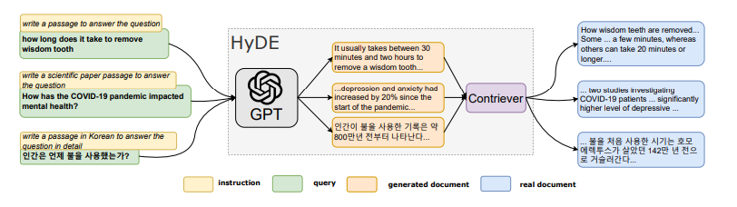
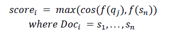

# HyDE with Query-based Re-ranking
> __Summary of "Retrieval Augmented Generation with Hypothetical Document Embedding and Query-based Re-ranking"__

## 1. Introduction
- **HyDE (Hypothesis Document Embeddings)** is a method that retrieves knowledge from a database by averaging the embeddings of a query with multiple hypotheses generated by a large language model (LLM). It achieves retrieval performance comparable to a fine-tuned retriever, even without requiring fine-tuning for semantic search.
- However, the HyDE has the limitation that it places the query on the same level as the ‘fake’ hypotheses generated by the LLM, even though the query contains the information the user wants. To compensate for the shorcomings of this HyDE, we propose a query-based re-ranking methodology.

## 2. Methodology
- This query-based re-ranking is simple: candidates are extracted using hypotheses excluding the query, and their ranks are reordered based on the similarity between the query and the sentences they contain. Through this process, candidates with sentences that have the greatest similarity to the query are given higher scores.

- In the original HyDE, when using N hypotheses, the query takes 1/(N+1) part of determining the ranking of candidates. However, with this re-ranking method, the query ultimately determines their ranks, allowing correct documents to be found even if the information the user wants appears only once in a single line. 

## 3. Performance
- We conducted an experiment in a <ins>*very small*</ins> database environment. We used approximately 1,000 KorQuAD 1.0 validation sets as a knowledge database, and evaluate retrieval performance of each type of query. We employed 'Sentence BERT' as an unsupervised retriever and 'KoAlpaca-1.2b' as a generator.

||ACC@1|ACC@5|ACC@10|ACC@30| 
|:---:|:---:|:---:|:---:|:---:|
|Query-only|46|77|82|94|
|__HyDE__-original (N=3)|48|73|81|94|
|__HyDE__-reranked (N=3)|72|90|92|95|

- For generation performance, We considered the generation correct if the actual answer was found within the text generated based on the retrieved document. When evaluating accuracy, 'HyDE re-ranked' showed 14 percentage point higher accuracy than 'Queury-only'. 
